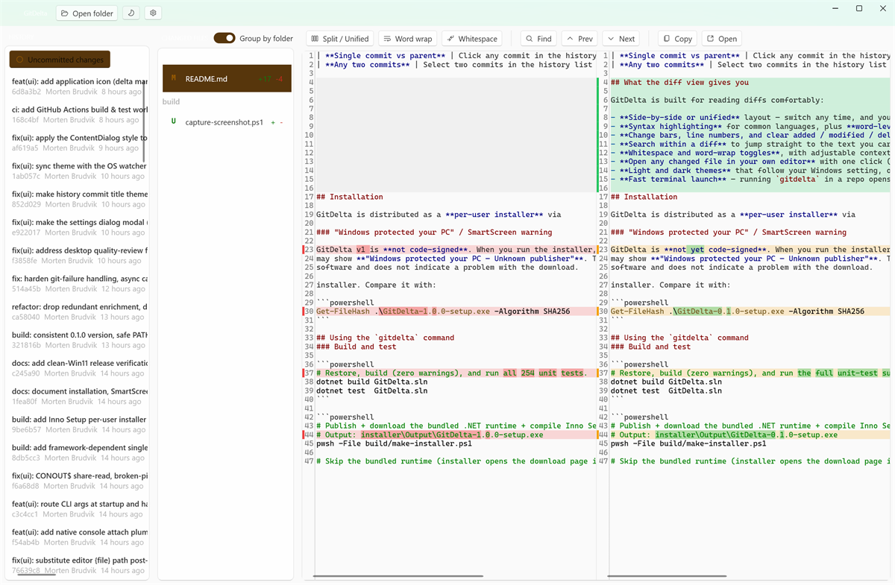
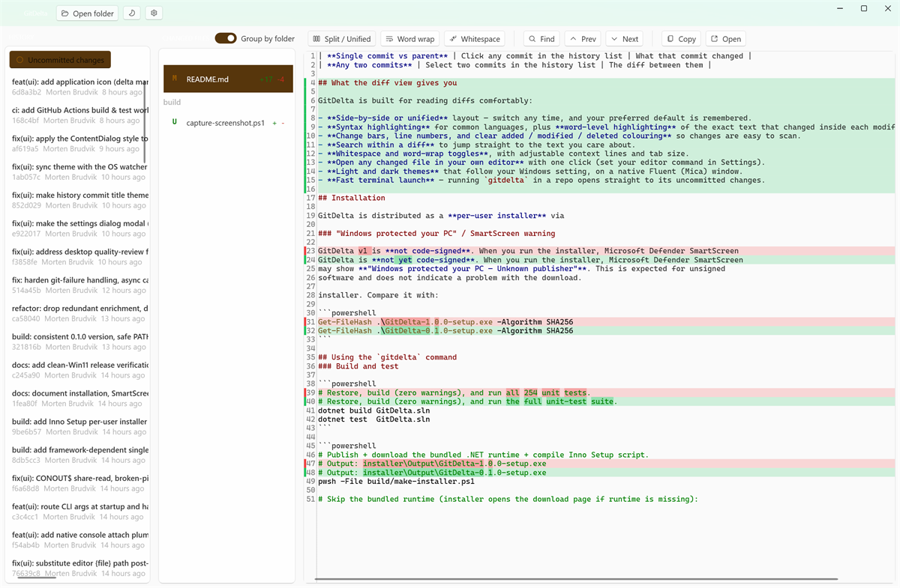

# GitDelta

GitDelta is a lightweight, native Windows 11 **read-only** Git diff and commit viewer.
Inspect uncommitted changes, what a single commit introduced, or the diff between any two
commits — in a modern Fluent UI. It is not a full Git client (no staging, committing, or
pushing); it only visualises.



## Three compare modes

| Mode | How to reach it | What you see |
|---|---|---|
| **Working tree vs HEAD** | Launch `gitdelta` in a repo, or click "Open folder" | All uncommitted changes in the working copy |
| **Single commit vs parent** | Click any commit in the history list | What that commit changed |
| **Any two commits** | Select two commits in the history list | The diff between them |

## What the diff view gives you

GitDelta is built for reading diffs comfortably:

- **Side-by-side or unified** layout — switch any time, and your preferred default is remembered.
- **Syntax highlighting** for common languages, plus **word-level highlighting** of the exact text that changed inside each modified line.
- **Change bars, line numbers, and clear added / modified / deleted colouring** so changes are easy to scan.
- **Search within a diff**, with next / previous match navigation, to jump straight to the text you care about.
- **Whitespace and word-wrap toggles**, with adjustable context lines and tab size.
- **Browse changed files** as a flat list or grouped by folder; copy a file's diff or **open it in your own editor** with one click (set your editor command in Settings).
- **Light and dark themes** that follow your Windows setting, on a native Fluent (Mica) window.
- **Fast terminal launch** — running `gitdelta` in a repo opens straight to its uncommitted changes.

The same diff, viewed inline in the unified layout:



## Installation

GitDelta is distributed as a **per-user installer** via
[GitHub Releases](https://github.com/mortenbrudvik/GitDelta/releases). Download
`GitDelta-<version>-setup.exe` and run it. No administrator rights are required — GitDelta
installs to `%LOCALAPPDATA%\Programs\GitDelta` for the current user only.

The installer will:

- Install `gitdelta.exe`.
- Add the install folder to your **per-user PATH** so you can run `gitdelta` from any terminal.
- Create a Start Menu shortcut and an entry in **Settings > Apps > Installed apps** (for clean uninstall).
- Detect the **.NET 10 Desktop Runtime** and, if it is missing, either install the bundled
  runtime silently or open the Microsoft download page.

### Prerequisites

- **Windows 11** (x64).
- **.NET 10 Desktop Runtime** — the installer adds it for you if missing.
  Download manually: <https://dotnet.microsoft.com/download/dotnet/10.0/runtime>
- **Git for Windows >= 2.30** on your PATH. GitDelta shells out to the `git` CLI; if `git` is not
  found it shows an actionable screen with a link to Git for Windows. Install via
  `winget install Git.Git` or from <https://git-scm.com/download/win>.

### "Windows protected your PC" / SmartScreen warning

GitDelta is **not yet code-signed**. When you run the installer, Microsoft Defender SmartScreen
may show **"Windows protected your PC — Unknown publisher"**. This is expected for unsigned
software and does not indicate a problem with the download.

To proceed:

1. Click **More info**.
2. Click **Run anyway**.

If you prefer, verify the download first: each GitHub Release lists the SHA-256 checksum of the
installer. Compare it with:

```powershell
Get-FileHash .\GitDelta-0.1.0-setup.exe -Algorithm SHA256
```

## Using the `gitdelta` command

After installing (and **opening a new terminal** so the updated PATH takes effect), run:

| Command | What it does |
|---|---|
| `gitdelta` | Opens the repository in the current folder at the **working-tree-vs-HEAD** view. |
| `gitdelta <path>` | Opens the repository at `<path>` at the working-tree-vs-HEAD view. |
| `gitdelta` (outside a repo) | Opens the **start screen** with an "Open folder" picker. |
| `gitdelta --version` | Prints the version to the terminal and exits (supports redirection). |
| `gitdelta --help` | Prints usage to the terminal and exits. |

> **New PATH not picked up?** The installer broadcasts a system message so freshly opened
> terminals see the updated PATH immediately. Terminals that were already open **before** installing
> will not see `gitdelta` until you open a new one.

## Uninstalling

Uninstall from **Settings > Apps > Installed apps > GitDelta > Uninstall**, or via the
"Uninstall GitDelta" Start Menu shortcut. Uninstalling removes the install folder **and** the
PATH entry it added.

## Building from source

### Requirements

- [.NET 10 SDK](https://dotnet.microsoft.com/download/dotnet/10.0)
- [Git for Windows](https://git-scm.com/download/win)
- [Inno Setup 6](https://jrsoftware.org/isdl.php) (for building the installer only)
  — `winget install JRSoftware.InnoSetup`

### Build and test

```powershell
# Restore, build (zero warnings), and run the full unit-test suite.
dotnet build GitDelta.sln
dotnet test  GitDelta.sln
```

### Produce the single-file gitdelta.exe

```powershell
# Outputs publish\gitdelta.exe (~40-50 MB, framework-dependent single file).
pwsh -File build/publish.ps1

# Or equivalently, directly:
dotnet publish src/GitDelta.UI/GitDelta.UI.csproj -c Release -r win-x64 -p:PublishProfile=win-x64 -o publish
```

### Build the full installer

```powershell
# Publish + download the bundled .NET runtime + compile Inno Setup script.
# Output: installer\Output\GitDelta-0.1.0-setup.exe
pwsh -File build/make-installer.ps1

# Skip the bundled runtime (installer opens the download page if runtime is missing):
pwsh -File build/make-installer.ps1 -SkipRuntimeBundle
```

The publish profile (`src/GitDelta.UI/Properties/PublishProfiles/win-x64.pubxml`) keeps all
single-file publish properties out of the normal `.csproj`, so `dotnet build` and `dotnet test`
remain standard multi-file builds.
